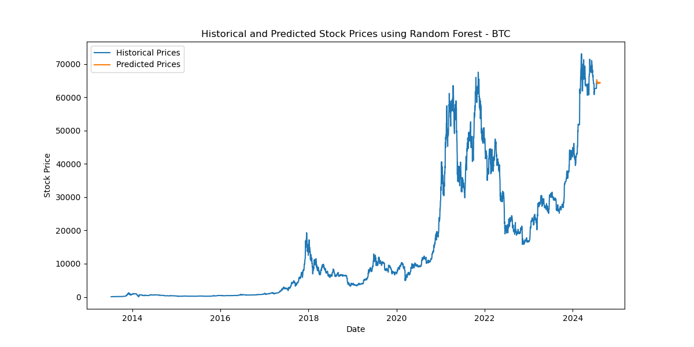

# Overview of Functionality

## Cryptocurrency Price Prediction and Trading Strategies

In this project, we analyzed three different machine learning models: Random Forest, LSTM Neural Network, and ML Predict. These models were used to evaluate and predict prices for three different cryptocurrencies: Bitcoin, Ethereum, and Solana. For backtesting the models, we employed three strategies: Moving Average Crossover Strategy, Mean Reversion Strategy, and Momentum Strategy.

## Summary

Overall, we found that the LSTM Neural Network provided fairly accurate predictions, although the Random Forest model also performed well. With more time, we would explore adjusting the parameters to see how they affect the accuracy of the predictions.

## Data Collection and Preparation

During the project, we pulled historical data for Bitcoin (BTC), Ethereum (ETH), and Solana (SOL) from three sources: Alpha Vantage, Coinbase, and CryptoCompare. While analyzing the data, we noticed inconsistencies in the data for the same timestamps. After researching, we discovered that different exchanges record data at different points within the same minute. For instance, Alpha Vantage might record data at 12:00:05 PM, Coinbase at 12:00:28 PM, and CryptoCompare at 12:00:58 PM. This difference in recording times resulted in fluctuations in the recorded prices, which could sometimes be as small as a few cents or as large as whole dollars. Given the high volatility of cryptocurrencies, these differences within the same minute are significant.

To address these inconsistencies, we cleaned, reformatted, and unified the data into a single dataset for each currency. While cleaning and unifying the data, we encountered problematic data points. To resolve this, we established a hierarchy of data sources to determine which source to trust most in case of conflicts. For example, we prioritized data from Alpha Vantage, followed by Coinbase, and then CryptoCompare. This hierarchy helped us handle NaNs and duplicates more effectively.

## Model Training and Prediction

After preparing the data, we trained three models: ML Predict, LSTM Neural Network, and Random Forest. Each model was trained to predict cryptocurrency prices, but some models performed better than others depending on the data format and shape.

- **LSTM Neural Network**: This model provided nearly 1-to-1 accuracy between actual prices and predicted prices, which was fascinating.
- **Random Forest**: This model also performed well, although not as accurately as the LSTM Neural Network.

The trained models saved their predictions as CSV and PNG files for visualization and stored their parameters as PKL files for future use and development.

## Backtesting Strategies

We implemented three trading strategies to backtest our models:

1. **Moving Average Crossover Strategy**
2. **Mean Reversion Strategy**
3. **Momentum Strategy**

We used Jupyter notebooks and Python scripts to explore how these strategies performed with our models. The results of the backtests were saved and visualized to assess the effectiveness of each strategy.

## Automated Workflow

To streamline the workflow, we implemented a `run_all.py` script, which allows users to control the entire application using the terminal or bash. The script uses a simple selector to choose the cryptocurrency to analyze:

```
BTC - []
ETH - []
SOL - []
ALL - []
```

Upon selection, the script activates a sequence that runs all related scripts and notebooks, from pulling new data to cleaning, reformatting, and unifying it, to feeding the models and recording the results using the three hard-coded strategies. The script then provides a comprehensive report on which strategy worked best and prompts the user to select a strategy and an investment amount:

```
STRAT-1 []
STRAT-2 []
STRAT-3 []

$100 - []
$500 - []
$1000 - []
```

The script then runs the backtest and reports the outcomes.

## Future Development

For future development, we would "pythonify" the notebooks to improve execution speed and add a selector for individual currency and strategy selection. This could be achieved by adding more Jupyter notebooks or Python scripts. Additionally, we would implement Monte Carlo simulations to add a layer of confidence in the data and decision-making.

## Visualizations

Below are some of the visualizations generated during the project:





## Presentation

For a detailed overview of our project, please refer to our presentation:
[Project Presentation](https://docs.google.com/presentation/d/1XfAbdBs7-9YeSN9AA8I8mvZzm48wQXF-y_o7q3IOCKI/edit#slide=id.g20f7af2584a_0_14)